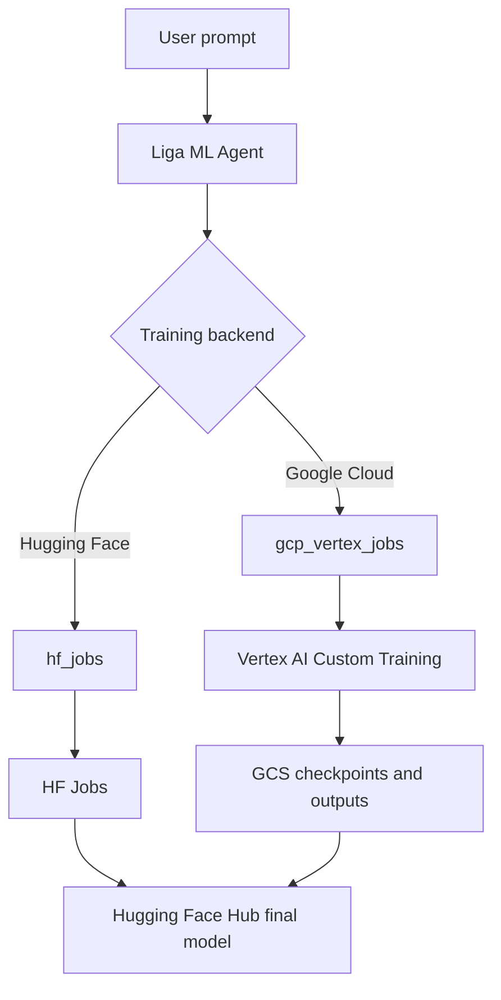

<p align="center">
  
</p>

# Liga ML Intern

An ML intern that autonomously researches, writes, and ships good quality ML related code using the Hugging Face ecosystem — with deep access to docs, papers, datasets, and cloud compute.

## Quick Start

### Installation

```bash
git clone git@github.com:Tushar7012/Liga_ML.git
cd Liga_ML
uv sync
uv tool install -e .
```

#### That's it. Now `ml-intern` works from any directory:

```bash
ml-intern
```

Create a `.env` file in the project root (or export these in your shell):

```bash
HF_TOKEN=<your-hugging-face-token>
GITHUB_TOKEN=<github-personal-access-token>
ML_INTERN_DEFAULT_MODEL_ID=moonshotai/Kimi-K2.6
ML_INTERN_KPIS_DISABLED=1

# Optional: enable Google Cloud Vertex AI training
GOOGLE_CLOUD_PROJECT=<your-gcp-project-id>
GOOGLE_CLOUD_REGION=us-central1
GCS_BUCKET=<your-training-bucket-name>
VERTEX_AI_STAGING_BUCKET=gs://<your-training-bucket-name>/vertex-staging
VERTEX_AI_OUTPUT_DIR=gs://<your-training-bucket-name>/vertex-outputs
```

If no `HF_TOKEN` is set, the CLI will prompt you to paste one on first launch. To get a GITHUB_TOKEN follow the tutorial [here](https://docs.github.com/en/authentication/keeping-your-account-and-data-secure/managing-your-personal-access-tokens#creating-a-fine-grained-personal-access-token).

### Usage

**Interactive mode** (start a chat session):

```bash
ml-intern
```

**Headless mode** (single prompt, auto-approve):

```bash
ml-intern "fine-tune llama on my dataset"
```

**Options:**

```bash
ml-intern --model moonshotai/Kimi-K2.6 "your prompt"
ml-intern --max-iterations 100 "your prompt"
ml-intern --no-stream "your prompt"
```

## Architecture

### Component Overview

```
┌─────────────────────────────────────────────────────────────┐
│                         User/CLI                            │
└────────────┬─────────────────────────────────────┬──────────┘
             │ Operations                          │ Events
             ↓ (user_input, exec_approval,         ↑
      submission_queue  interrupt, compact, ...)  event_queue
             │                                          │
             ↓                                          │
┌────────────────────────────────────────────────────┐  │
│            submission_loop (agent_loop.py)         │  │
│  ┌──────────────────────────────────────────────┐  │  │
│  │  1. Receive Operation from queue             │  │  │
│  │  2. Route to handler (run_agent/compact/...) │  │  │
│  └──────────────────────────────────────────────┘  │  │
│                      ↓                             │  │
│  ┌──────────────────────────────────────────────┐  │  │
│  │         Handlers.run_agent()                 │  ├──┤
│  │                                              │  │  │
│  │  ┌────────────────────────────────────────┐  │  │  │
│  │  │  Agentic Loop (max 300 iterations)     │  │  │  │
│  │  │                                        │  │  │  │
│  │  │  ┌──────────────────────────────────┐  │  │  │  │
│  │  │  │ Session                          │  │  │  │  │
│  │  │  │  ┌────────────────────────────┐  │  │  │  │  │
│  │  │  │  │ ContextManager             │  │  │  │  │  │
│  │  │  │  │ • Message history          │  │  │  │  │  │
│  │  │  │  │   (litellm.Message[])      │  │  │  │  │  │
│  │  │  │  │ • Auto-compaction (170k)   │  │  │  │  │  │
│  │  │  │  │ • Session upload to HF     │  │  │  │  │  │
│  │  │  │  └────────────────────────────┘  │  │  │  │  │
│  │  │  │                                  │  │  │  │  │
│  │  │  │  ┌────────────────────────────┐  │  │  │  │  │
│  │  │  │  │ ToolRouter                 │  │  │  │  │  │
│  │  │  │  │  ├─ HF docs & research     │  │  │  │  │  │
│  │  │  │  │  ├─ HF repos, datasets,    │  │  │  │  │  │
│  │  │  │  │  │  jobs, papers           │  │  │  │  │  │
│  │  │  │  │  ├─ GitHub code search     │  │  │  │  │  │
│  │  │  │  │  ├─ Sandbox & local tools  │  │  │  │  │  │
│  │  │  │  │  ├─ Planning               │  │  │  │  │  │
│  │  │  │  │  └─ MCP server tools       │  │  │  │  │  │
│  │  │  │  └────────────────────────────┘  │  │  │  │  │
│  │  │  └──────────────────────────────────┘  │  │  │  │
│  │  │                                        │  │  │  │
│  │  │  ┌──────────────────────────────────┐  │  │  │  │
│  │  │  │ Doom Loop Detector               │  │  │  │  │
│  │  │  │ • Detects repeated tool patterns │  │  │  │  │
│  │  │  │ • Injects corrective prompts     │  │  │  │  │
│  │  │  └──────────────────────────────────┘  │  │  │  │
│  │  │                                        │  │  │  │
│  │  │  Loop:                                 │  │  │  │
│  │  │    1. LLM call (litellm.acompletion)   │  │  │  │
│  │  │       ↓                                │  │  │  │
│  │  │    2. Parse tool_calls[]               │  │  │  │
│  │  │       ↓                                │  │  │  │
│  │  │    3. Approval check                   │  │  │  │
│  │  │       (jobs, sandbox, destructive ops) │  │  │  │
│  │  │       ↓                                │  │  │  │
│  │  │    4. Execute via ToolRouter           │  │  │  │
│  │  │       ↓                                │  │  │  │
│  │  │    5. Add results to ContextManager    │  │  │  │
│  │  │       ↓                                │  │  │  │
│  │  │    6. Repeat if tool_calls exist       │  │  │  │
│  │  └────────────────────────────────────────┘  │  │  │
│  └──────────────────────────────────────────────┘  │  │
└────────────────────────────────────────────────────┴──┘
```

### Agentic Loop Flow

```
User Message
     ↓
[Add to ContextManager]
     ↓
     ╔═══════════════════════════════════════════╗
     ║      Iteration Loop (max 300)             ║
     ║                                           ║
     ║  Get messages + tool specs                ║
     ║         ↓                                 ║
     ║  litellm.acompletion()                    ║
     ║         ↓                                 ║
     ║  Has tool_calls? ──No──> Done             ║
     ║         │                                 ║
     ║        Yes                                ║
     ║         ↓                                 ║
     ║  Add assistant msg (with tool_calls)      ║
     ║         ↓                                 ║
     ║  Doom loop check                          ║
     ║         ↓                                 ║
     ║  For each tool_call:                      ║
     ║    • Needs approval? ──Yes──> Wait for    ║
     ║    │                         user confirm ║
     ║    No                                     ║
     ║    ↓                                      ║
     ║    • ToolRouter.execute_tool()            ║
     ║    • Add result to ContextManager         ║
     ║         ↓                                 ║
     ║  Continue loop ─────────────────┐         ║
     ║         ↑                       │         ║
     ║         └───────────────────────┘         ║
     ╚═══════════════════════════════════════════╝
```

## Events

The agent emits the following events via `event_queue`:

- `processing` - Starting to process user input
- `ready` - Agent is ready for input
- `assistant_chunk` - Streaming token chunk
- `assistant_message` - Complete LLM response text
- `assistant_stream_end` - Token stream finished
- `tool_call` - Tool being called with arguments
- `tool_output` - Tool execution result
- `tool_log` - Informational tool log message
- `tool_state_change` - Tool execution state transition
- `approval_required` - Requesting user approval for sensitive operations
- `turn_complete` - Agent finished processing
- `error` - Error occurred during processing
- `interrupted` - Agent was interrupted
- `compacted` - Context was compacted
- `undo_complete` - Undo operation completed
- `shutdown` - Agent shutting down

## Development

### Adding Built-in Tools

Edit `agent/core/tools.py`:

```python
def create_builtin_tools() -> list[ToolSpec]:
    return [
        ToolSpec(
            name="your_tool",
            description="What your tool does",
            parameters={
                "type": "object",
                "properties": {
                    "param": {"type": "string", "description": "Parameter description"}
                },
                "required": ["param"]
            },
            handler=your_async_handler
        ),
        # ... existing tools
    ]
```

### Adding MCP Servers

Edit `configs/cli_agent_config.json` or `configs/frontend_agent_config.json`:

```json
{
  "model_name": "moonshotai/Kimi-K2.6",
  "mcpServers": {
    "your-server-name": {
      "transport": "http",
      "url": "https://example.com/mcp",
      "headers": {
        "Authorization": "Bearer ${YOUR_TOKEN}"
      }
    }
  }
}
```

Note: Environment variables like `${YOUR_TOKEN}` are auto-substituted from `.env`.

## Google Cloud Vertex AI Training

Liga ML can run training on either Hugging Face Jobs or Google Cloud Vertex AI. Hugging Face remains the common model registry: whether a model is trained on HF compute or Vertex AI, the final successful model should be pushed back to Hugging Face Hub.

For production Cloud Run and Vertex AI setup, see [Google Cloud deployment](docs/google-cloud-deployment.md) and [GCloud merge readiness](docs/gcloud-merge-readiness.md). Local validation helpers live at [`scripts/check_gcp_readiness.py`](scripts/check_gcp_readiness.py) and [`scripts/gcloud_vertex_dry_run.py`](scripts/gcloud_vertex_dry_run.py).

### Workflow



### Required GCP Configuration

Set these on Cloud Run, or locally in `.env` for development:

```bash
GOOGLE_CLOUD_PROJECT=<your-gcp-project-id>
GOOGLE_CLOUD_REGION=us-central1
GCS_BUCKET=<your-training-bucket-name>
VERTEX_AI_STAGING_BUCKET=gs://<your-training-bucket-name>/vertex-staging
VERTEX_AI_OUTPUT_DIR=gs://<your-training-bucket-name>/vertex-outputs
```

For Cloud Run, prefer an attached service account instead of a JSON key. The service account needs:

```text
roles/aiplatform.user
roles/storage.objectAdmin
roles/logging.viewer
roles/artifactregistry.reader
```

If Vertex jobs run as a separate service account, also grant:

```text
roles/iam.serviceAccountUser
```

Enable these APIs in the GCP project:

```text
Vertex AI API
Cloud Storage API
Cloud Logging API
Artifact Registry API
Cloud Build API
```

### Example Prompt

```text
Fine-tune a model for Indian GST notice classification using Google Cloud Vertex AI. Save checkpoints to GCS and push the final model to Hugging Face Hub.
```

## AWS SageMaker Training

AWS SageMaker support is deployment-gated behind explicit AWS environment, IAM, S3, and training image configuration. See [AWS SageMaker deployment](docs/aws-sagemaker-deployment.md) and [AWS merge readiness](docs/aws-merge-readiness.md). Local validation helpers live at [`scripts/check_aws_readiness.py`](scripts/check_aws_readiness.py) and [`scripts/aws_sagemaker_dry_run.py`](scripts/aws_sagemaker_dry_run.py).

## License

MIT License
